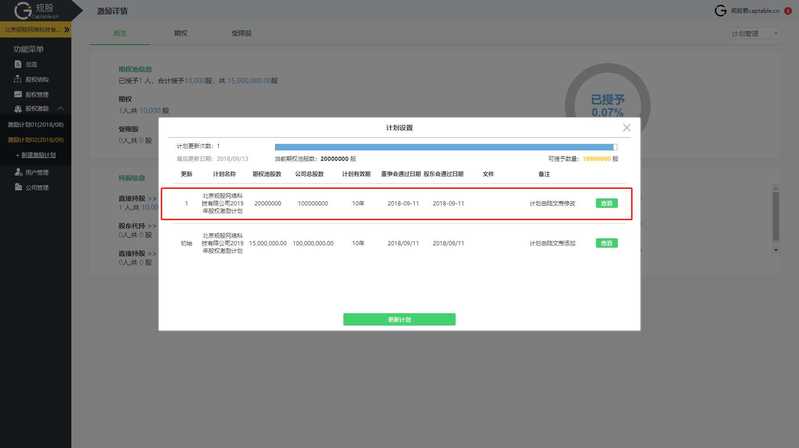

# 管理公司股权激励计划

## 为什么要管理公司股权激励计划

通常来说，公司发展到A轮左右阶段，为了 吸引外部优秀人才、留住内部现有员工、让员工与公司达成一致的目标、促使员工为公司创造价值、鼓励长期发展，以实现公司的长期发展规划，都会开始执行股权激励计划。

股权激励计划涉及到大量的计划相关文件及股权激励授予协议，当公司高层需要查阅股权激励计划或相关员工股权授予信息时，由于需要从大量的协议及文件里翻阅信息，非常不便于管理。同时，很多员工在和公司签署完股权激励授予协议后，对手中厚厚的协议文件完全一脸茫然，不清除到底有多少价值，对一些协议中成熟（兑现）、行权、退出相关的重要信息也完全不知晓。甚至有些公司和员工签署完协议后，直接将协议收走，员工手中连凭证都没有，完全没有达到股权激励的效果。

在规股公司系统的**股权激励**模块中，公司系统管理员可以导入公司股权激励计划的信息，并形成一个可在线管理的期权池，可随时追踪最新的期权池授予、成熟及留存等重要信息。同时，将员工的的股权激励授予信息以**股权激励电子证书**的形式记录下来，由公司及员工（被激励对象）双方签字后存入公司及个人的系统中，便于公司管理。当员工被授予的激励股权成熟后，系统会发出成熟提醒，可以让员工随时获取最新的激励股权成熟状态及价值信息，从而提升对所授予股权的重视，以系统化的管理模式提升公司的股权激励效果及管理水平。

## 如何用系统管理公司股权激励计划


**需要公司已有股权激励计划后方可使用。若公司尚未制定股权激励，请联系公司法律顾问或规股客服。否则该功能仅可用于公司内部模拟，所发放证书不具备任何真实效力。**


### 1.创建股权激励计划

在公司系统左侧菜单栏中，点击“新建激励计划按钮”

系统出现激励计划创建窗口-步骤1/3，页面左侧菜单出现新的默认计划简称黄色按钮

依次输入以下信息：

**计划全名**：公司股权激励计划全称，通常为激励计划文件名称

**当前总股（虚拟股）数**：为方便公司管理及授予，公司（国内的有限公司）股权激励计划在制定时通常会将注册资本放大整数倍数，例如100倍，作为公司的虚拟股总数，在进行股权激励授予时，以虚拟股作为基础单位。

为寻求海外上市的公司在搭建VIE架构后，以开曼公司作为上市主体的公司，由于在登记注册时直接采用了_额定股数（ authorised shares）_，可以直接在此记录额定股数。



**当前注册资本**：公司制定股权激励计划时的注册资本总额，通常与**当前总虚拟股数**挂钩

**期权池比例**：用于股权激励的股数占公司**当前总股（虚拟股）数**的比例

**期权池股（虚拟股）数**：用于股权激励的股权总数量，通常俗称为_期权池（option pool）_

**计划有效期**：股权激励计划的有效期长度，在激励计划中确定，通常为5~10年

**董事会通过日期**：董事会决议通过公司股权激励计划的日期

**股东会通过日期**：股东会决议通过公司股权激励计划的日期

上传文件：

上传激励计划、股东会决议、董事会决议及其他相关文件



点击“下一步”出现激励计划创建窗口-步骤2/3  

系统默认公司仅有一个子计划，可点击绿色的“点击添加子计划”按钮，添加新的子计划，或者直接点“下一步”跳过



编辑完子计划后，点击“下一步”出现激励计划创建窗口-步骤3/3

需根据公司当前的股权激励计划，对应激励股权持股方式。



如持股方式为**股东代持**，则点击持股方式右侧的单选按钮，并点击“请选择代持股东”菜单按钮，在弹出的菜单中选择“+添加新的代持股东”

在添加代持股东弹窗中，录入代持股东姓名、证件号码、及在工商登记的认缴出资额，输入完成后点击绿色“添加”按钮

若选择持股方式为**持股平台**，则点击持股平台选项右侧的单选按钮，并点击“请选择持股平台”菜单按钮，在弹出的菜单中选择“+添加新的持股平台”。

在添加持股平台弹窗中依次输入：

**平台类型**：选择有限合伙企业或有限责任公司作为持股平台的类型

**平台全程**：持股平台名称

**注册资本**：持股平台在工商登记的注册资本

**认缴出资额**：持股平台在股权激励授予主体持有股权所对应的注册资本

设置完持股方式后，点击下方蓝色“完成”按钮，即完成公司股权激励计划的系统导入

进入股权激励计划概览页面，可以看到当前的**期权池信息**、**持股信息**及**子计划详情**

### 2. 添加股权激励证书草稿

点击红色框内的期权或股权选项卡，进入期权或受限股信息列表



#### 添加期权证书草稿

进入期权列表（如添加受限股则进入受限股列表），点击右侧的“添加期权”按钮

点击“新建授予草稿”按钮

出现股权激励授予信息输入弹窗

在授予草稿弹窗中输入以下授予信息：

#### 1.归属子计划

选择子计划，如创建计划时未设置子计划，则选项为“默认子计划”

#### 2.股权激励

* **类型**：选择期权或受限股类型，当前只有唯一选项
* **自定义编号**：可以自定义生成的股权激励证书编号（可选输入）

#### 3.被授予人

* **姓名**：选择被授予人姓名（在`用户管理`模块中添加用户）
* **证件号码**：被授予人身份证件号码
* **英文名**：被授予人英文名（可选输入）



#### 4.授予详情

* **授予数量**：激励对象获得的激励股权数量（境内公司通常为虚拟股单位数）
* **授予日期**：激励对象获得激励股权的日期，通常为授予协议签署日期
* **行权单价**：期权的行权单价，在授予协议中约定（如发放受限股，则此项为受限股购买单价）
* **行权总价**：期权的行权总价，等于 $$行权单价*授予数量$$ （如发放受限股，则此项为受限股购买总价）

#### 5.兑现安排

设置股权的兑现（也称“锁定”“成熟”“解限”等）安排

如设置兑现安排，则同时需输入兑现起算日期（即从哪一天开始计算股权兑现）。

如激励对象的激励股权不设置对象条件，则选择“立即兑现”

#### 6.附件文档

 可在此添加授予协议或其他相关法律文件、说明文档等。

#### 7.备注

其他需要备注在电子授予证书上的重要信息。

点击授予草稿弹窗下方绿色“保存”按钮

期权草稿箱中出现新的期权证书草稿记录

### 3. 证书签字

点击记录右侧的弹窗按钮，选择“提交签字”

公司系统股权激励授予签字人将收到消息中心提醒（可在公司管理中更改股权激励签字人）




注：以下步骤只有股权激励证书签字人（公司签字人、激励对象）能进行：


* **公司签字人操作**

点击进入消息中心界面，操作列表中出现签字邀请

点击操作按钮，出现签字框（如签字人未实名认证，会出现实名认证提示框）

根据提示输入真实姓名作为签名并点击下方蓝色“签名并发送”按钮，即成功完成签名。

* **激励对象操作**

当公司签字人完成签字后，激励对象会收到签字邀请，打开消息中心

点击操作按钮，出现签字框（如签字人未实名认证，会出现实名认证提示框）

根据提示输入真实姓名作为签名并点击下方蓝色“签名并发送”按钮，激励对象签名完成即代表确认并接受证书。

在激励对象个人系统的`我的资产`中，出现新的资产记录。

公司系统的`股权激励`期权列表中，出现新的股权激励授予记录

### 4.调整股权激励计划

在股权激励中，点击页面右上方的“计划管理”弹窗按钮

出现计划管理弹窗菜单，功能分别如下：

* **基本信息**：查看或更新股权激励计划的基本信息，包括名称、期权池、计划有效期等重要信息

操作：

在计划设置弹窗中，点击绿色“更新计划”按钮

在新的弹窗中，输入更新后的激励计划，例如这里我们将期权池大小从15%调整到20%，点击“下一步，确认本次更新”绿色按钮


调整后的期权池股数不可小于当前已在系统授予股权证书对应的股数总和


在确认弹窗中，点击“保存更新”按钮

计划设置中，激励计划信息更新，并出现新的更新记录

* **子计划**：修改自定义子计划
* **持股方式**：修改当前默认的股权激励持股方式
* **修改简称**：修改股权激励计划的简称

